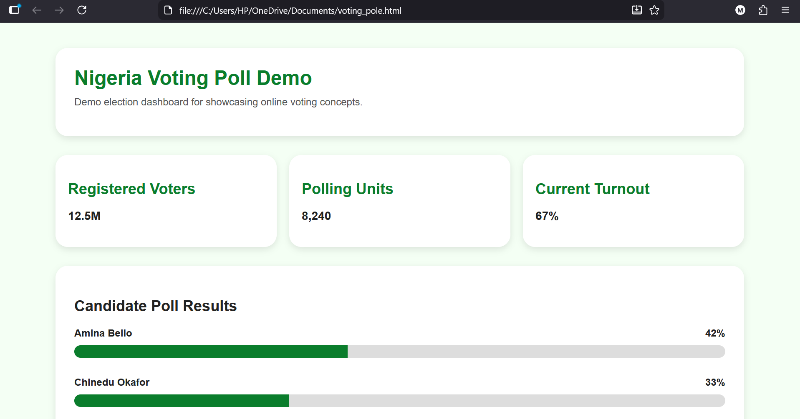
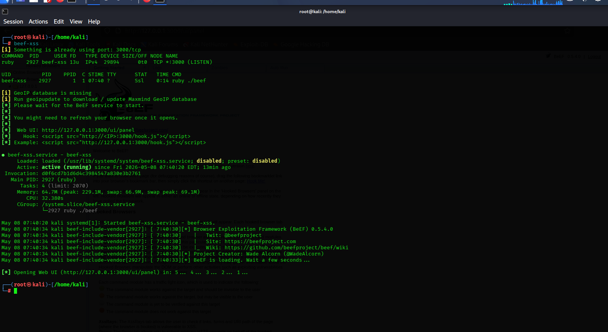
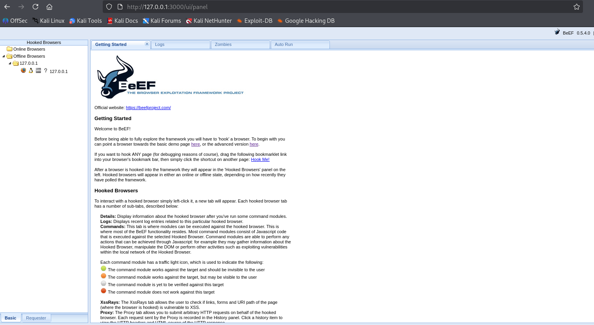
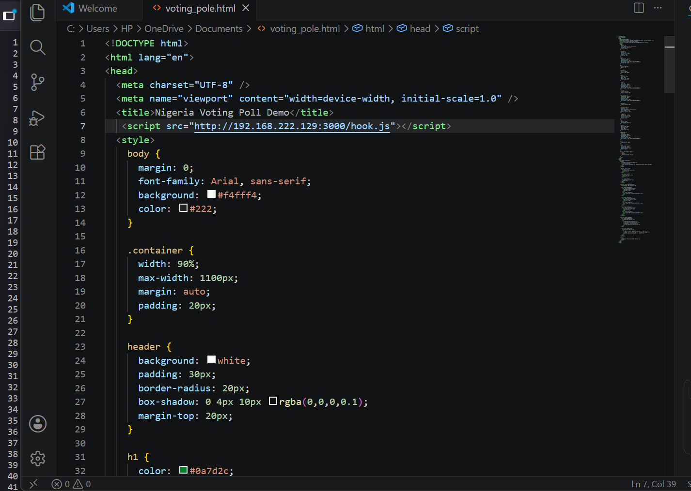
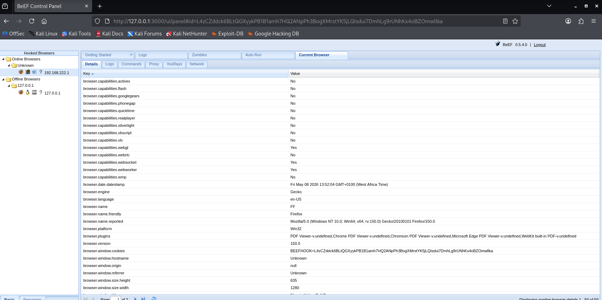

# Objective

To demonstrate how Cross-Site Scripting (XSS) vulnerabilities can be used to hook a browser session using BeEF-XSS in a controlled lab environment.

# Environment

- Attacker: Kali Linux
- Target: Custom Demo Web Application
- Framework: BeEF-XSS
- Network: Local Virtual Lab

# Tools Used

- BeEF-XSS
- Kali Linux
- Firefox Browser
- Custom Demo Website

# Methodology

## The assessment followed a structured approach:

- Create a vulnerable demo website
- Start the BeEF-XSS framework
- Inject the BeEF hook payload
- Trigger the XSS payload
- Establish browser hook connection
- Observe hooked browser interaction

# Part 1: Demo Website Setup

## To create a local demo web page for safe XSS testing.

Demo Website screenshot

# Part 2: BeEF-XSS Setup
 ## Starting BeEF-XSS
 
 beef-xss startup screenshot

 The BeEF control panel was started successfully.

BeEF Dashboard Screenshot

# Part 3: XSS Payload Injection
## Payload Injection
A BeEF hook script was injected into the vulnerable input field of the demo application.

Example Payload

NOTE: the Ip (192.168.222.129) above is attacker ip

Payload screenshot

# Part 4: Browser Hooking
## Hooked Browser

After the payload executed, the browser connected to the BeEF control panel.

Hook Success screenshot

