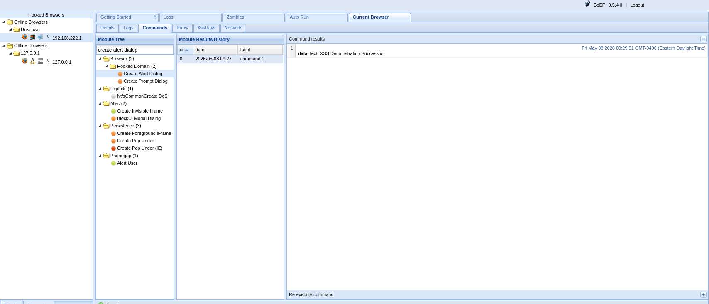

# Objective
To demonstrate how Cross-Site Scripting (XSS) vulnerabilities can be used to hook a browser session using BeEF-XSS in a controlled lab environment.

# Environment
- Attacker: Kali Linux
- Target: Custom Demo Web Application
- Framework: BeEF-XSS
- Network: Local Virtual Lab

# Tools Used
- BeEF-XSS
- Kali Linux
- Firefox Browser
- Custom Demo Website

# Methodology
## The assessment followed a structured approach:
- Create a vulnerable demo website
- Start the BeEF-XSS framework
- Inject the BeEF hook payload
- Trigger the XSS payload
- Establish browser hook connection
- Observe hooked browser interaction

# Part 1: Demo Website Setup
## created a local demo web page for safe XSS testing.

#### Demo Website screenshot

# Part 2: BeEF-XSS Setup
 ##### Starting Beef-XSS
 beef-xss
 
 #### beef-xss startup screenshot

 The BeEF control panel was started successfully.

BeEF Dashboard Screenshot

# Part 3: XSS Payload Injection
## Payload Injection
A BeEF hook script was injected into the vulnerable input field of the demo application.

Example Payload

NOTE: the Ip address (192.168.222.129) above is attacker ip

#### Payload screenshot

# Part 4: Browser Hooking
## Hook Analysis

Purpose:
To analyze browser information collected after successful hook execution.

#### Hook Success & Browser Details screenshot

# Part 5: Safe Demonstration Interaction
## Demonstration

Safe browser interaction modules were demonstrated by creating and sending alart Dialog to target saying "XSS Demonstration Successfull" within the controlled lab environment.

#### Interaction Screenshot

# Findings
- Cross-Site Scripting vulnerabilities can allow malicious JavaScript execution
- Browser hooking can occur when input validation is not implemented properly
- Client-side attacks can expose browser information and session interaction risks

# Risk Analysis
- XSS vulnerabilities may lead to session hijacking and browser manipulation
- Poor input validation increases web application attack surface
- Client-side trust assumptions can be abused by attackers

# Mitigation
- Implement proper input validation and sanitization
- Use Content Security Policy (CSP)
- Encode user-generated content before rendering
- Validate and filter script injection attempts
- Conduct regular web application security testing

# Conclusion
This lab demonstrates how Cross-Site Scripting vulnerabilities can be abused to establish browser hooks using BeEF-XSS. The assessment highlights the importance of secure coding practices, proper input validation, and continuous web application security testing.

# Disclaimer
All activities, scans, exploitations, and simulations demonstrated in this repository were conducted in a controlled lab environment for educational and ethical purposes only. The target systems used were intentionally vulnerable systems owned or authorized for testing. Unauthorized testing against real-world systems is illegal and unethical.
